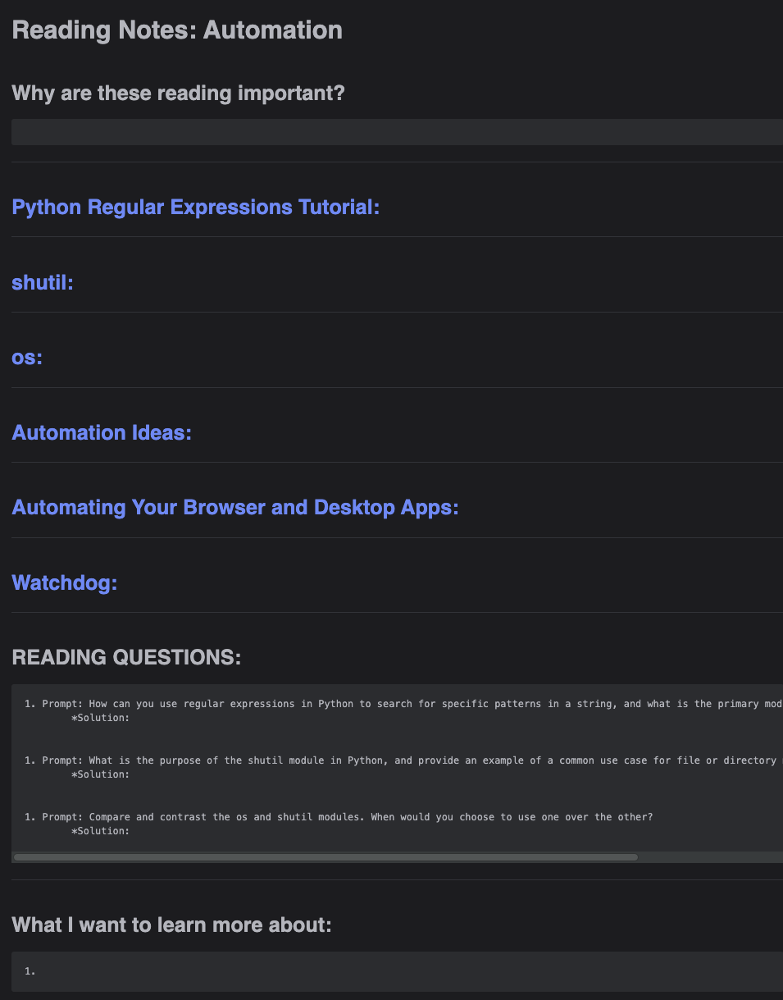

# Code Fellows Reading Webscraper

## Author:
Jacob Bassett

## Date:
11/13/2023

## Description:
This is a webscraper to extract the links and questions from a Code Fellows Reading Url. It will create a new file that you can copy into your reading notes and fill in.

## Usage:
First create a ".env" file at the root directory. Add the following to it.

```markdown
canvas_username = "your-username"
canvas_password = "your-password"
```

Next, copy the url for a Code Fellows Reading. ie: "https://canvas.instructure.com/courses/7689176/discussion_topics/19485328"

With the url copied to your clipboard run the following in your terminal.

```terminal
python scraper/reading.py
```
Note that you might need to add or remove some text but this is just a template to get you started and save you a few minutes. Hope it does.

## Expected Output
